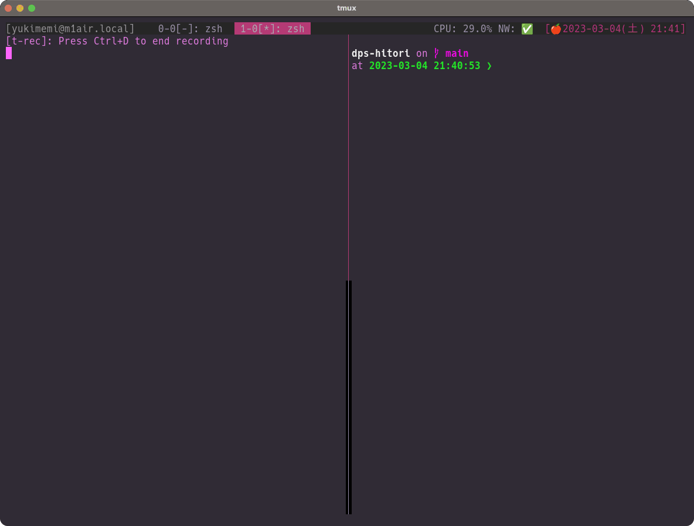

# dps-hitori

Plugin similar to [neovim-remote](https://github.com/mhinz/neovim-remote) and [vim-singleton](https://github.com/thinca/vim-singleton) using [denops.vim](https://github.com/vim-denops/denops.vim) .



## Require.

- [Deno - A modern runtime for JavaScript and TypeScript](https://deno.land/)
- [vim-denops/denops.vim: 🐜 An ecosystem of Vim/Neovim which allows developers to write cross-platform plugins in Deno](https://github.com/vim-denops/denops.vim)

## Config.

No settings are required. However, the following settings can be made if necessary.

```vim
" This is the default setting.
let g:hitori_debug = v:false  " debug console.log
let g:hitori_enable = v:true  " enable or disable this plugin.
let g:hitori_quit = v:true    " whether to exit after attaching
let g:hitori_port = 7070      " using websocket port

" This is the black list buffer name patterns. default is []."
let g:hitori_blacklist_patterns = ["\\.tmp$", "\\.diff$", "(COMMIT_EDIT|TAG_EDIT|MERGE_|SQUASH_)MSG$"]
```

## Command.

```vim
" Disable hitori.
:DisableHitori

" Enable hitori.
:EnableHitori
```

## hitori command !

Before starting Neovim, you can use the `hitori` command to check if the WebSocket server is already running, and if it is, directly send the path of the argument via the WebSocket, otherwise start Neovim.

To use `nvim`, use the following command:

```sh
deno install --force --allow-net --allow-run --allow-read --name hitori https://raw.githubusercontent.com/yukimemi/dps-hitori/main/cmd/hitori_nvim.ts
```

To use `nvim-qt`, use the following command:

```sh
deno install --force --allow-net --allow-run --allow-read --name hitori https://raw.githubusercontent.com/yukimemi/dps-hitori/main/cmd/hitori_nvim-qt.ts
```

To use `neovide`, use the following command:

```sh
deno install --force --allow-net --allow-run --allow-read --name hitori https://raw.githubusercontent.com/yukimemi/dps-hitori/main/cmd/hitori_neovide.ts
```
